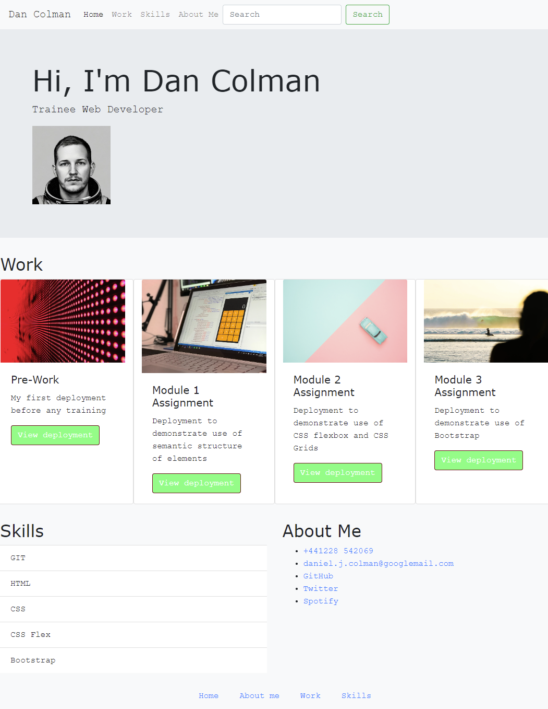

# bootstrap-portfolio
Week 3 assignment
## Installation

URL: https://42-djc.github.io/bootstrap-portfolio/

## Usage

Page comprised of:

Nav Bar - using Bootstrap, included page links and hover over effecsts

Jumbotron - using Bootstrap

Sections on Work - using Bootsrap Row and Column classes and cards to create a grid that is responsive to screen size without media queries. Buttons have hover over effects.

Sections on Skills and About Me - using bootstrap Row and Column classes so they appear on the same row. 

Footer - has working links and hover over effects.

See screenshot below:

## Credits

n/a

## Licenses

n/a

## Badges

n/a

## Features

see Usage

## How to contribute

n/a

